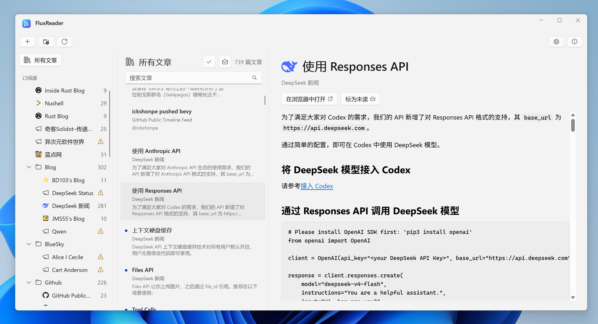

  

<h1 align="center">FluxReader</h1>

A local RSS and Atom reader designed for Windows 11.

## Install

FluxReader requires Windows 11 and is available for x64 and ARM64 PCs.

1. Download the matching `FluxReaderSetup` executable from [GitHub Releases](https://github.com/lomirus/flux-reader/releases).
2. Run Setup and launch FluxReader from the Start menu.

Setup installs missing Microsoft runtimes when required, so installation may need an internet connection. Current builds are unsigned; Windows may display an **Unknown publisher** warning for files downloaded from the internet.

## About FluxReader

### Your feeds stay portable

Import subscriptions from another reader with OPML, or export them whenever you want to move elsewhere. FluxReader preserves single-level groups; nested OPML folders are flattened into single-level group paths during import.

### Local by default

FluxReader stores its data in `%LOCALAPPDATA%\FluxReader` and does not use a cloud account. Article HTML is sanitized, scripts are disabled, and links open in your system browser.

### Languages

The interface is available in Simplified Chinese, Traditional Chinese, English, French, German, Italian, Spanish (Spain and Latin America), Portuguese (Brazil), Polish, Russian, Japanese, and Korean. FluxReader matches the system language on first launch and falls back to English when the language is unsupported.

## Project links

- [Development, testing, installer builds, and releases](docs/development.md)
- [Report an issue](https://github.com/lomirus/flux-reader/issues)
- [MIT License](LICENSE)
